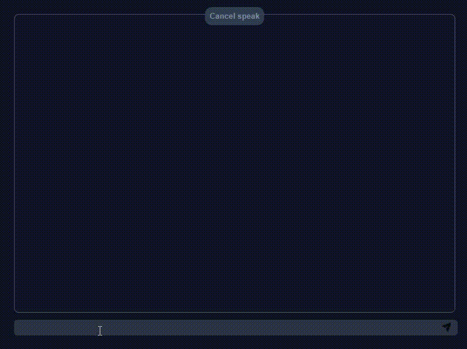

# EVA



> A desktop application built using electron, openai and speechSynthesis

# Generate image

To generate an image use the command */image **name**/*.

## Installation

```sh
$ git clone https://github.com/TacioAntonio/eva.git
$ cd eva
$ npm i
$ npm start
```

## Build

You can use [electron-builder](https://www.electron.build) to package and create a distribution-ready Electron app for macOS, Windows, and Linux with “auto-update” support out of the box.

## Contribution

Please read [CONTRIBUTING.md](https://github.com/TacioAntonio/eva/blob/master/CONTRIBUTING.md) for details on our code of conduct, and the process for submitting pull requests to us.

## Versioning

We use [SemVer](http://semver.org/) for versioning. For the versions available, see the [tags on this repository](https://github.com/TacioAntonio/eva/tags).

## Author


|  |
| -------------------------------------------------------------------------------- |
| [Tácio Antônio](https://github.com/TacioAntonio/)                            |

See also the list of [contributors](https://github.com/TacioAntonio/eva/graphs/contributors) who participated in this project.

## License

This project is licensed under the MIT License - see the [LICENSE.md](https://github.com/TacioAntonio/eva/blob/master/LICENSE.md) file for details.
